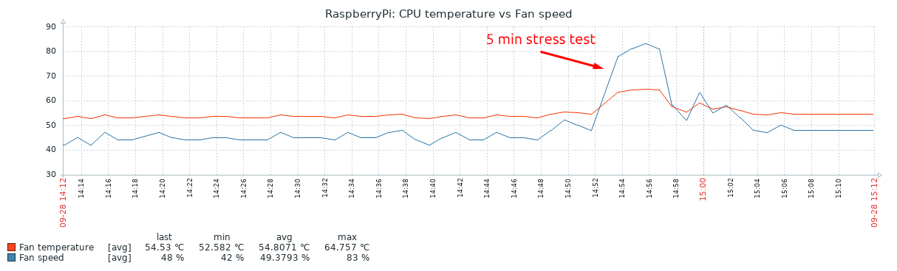

# Raspberry Pi PWM fan control
The [original case fan](https://www.raspberrypi.org/products/raspberry-pi-4-case-fan) is pretty loud and this is annoying. This script allows adjusting the fan speed dynamically depending on the CPU temperature. As a result, the average fan speed with no significant load is around 40-50% and the fan noise level is almost silent. Also, it should increase the fan life.
\
The **Hardware PWM** is used in this script, which allows using all the built-in PWM possibilities e.g. precise frequency control and no CPU usage for PWM generation.
\
See`rpi-hardware-pwm` library installation here https://pypi.org/project/rpi-hardware-pwm (currently tested with v0.1.3).

## Config variables
**MIN_TEMP** (default: **40**) - if the CPU temperature is below `MIN_TEMP` the fan will be completely off. At `MIN_TEMP` the fan speed will be set to `FAN_LOW`.
**MAX_TEMP** (default: **70**) - if the CPU temperature is above `MAX_TEMP` the fan will be set to the maximum speed. At `MAX_TEMP` the fan speed will be set to `FAN_HIGH`.
**FAN_LOW** (default: **0**) - fan low speed limit for mapping from `MIN_TEMP` to `MAX_TEMP`.
**FAN_HIGH** (default: **100**) - fan high speed limit for mapping from `MIN_TEMP` to `MAX_TEMP`.
**WAIT_TIME** (default: **1**) - read CPU temperature and adjust fan speed every `WAIT_TIME` seconds.
**PWM_FREQ** (default: **10000**) - PWM frequency to control the fan in Hertz.
**JSON** (default: **True**) - write fan metrics to JSON file for monitoring.
**VERBOSE** (default: **False**) - print fan metrics to console.

## Service
systemd service unit is created for convenient autostart and management. Copy `pwm-fan-control.service` file to `/etc/systemd/system` directory and reload daemon with `systemctl daemon-reload` command. Then you will be able to do:

    # systemctl enable/disable pwm-fan-control
    # systemctl start/stop/restart pwm-fan-control

## Testing and results
With the recommended default settings I got the following results (all numbers are average)
- Idle: CPU temperature is 53-54℃, fan speed is 42-45% with CPU utilization of 9-10% and Load Average of 0.55
- Stress test: CPU temperature is 64-65℃, fan speed is 80-83% under the max load (`stress --cpu 4 --timeout 300`)
